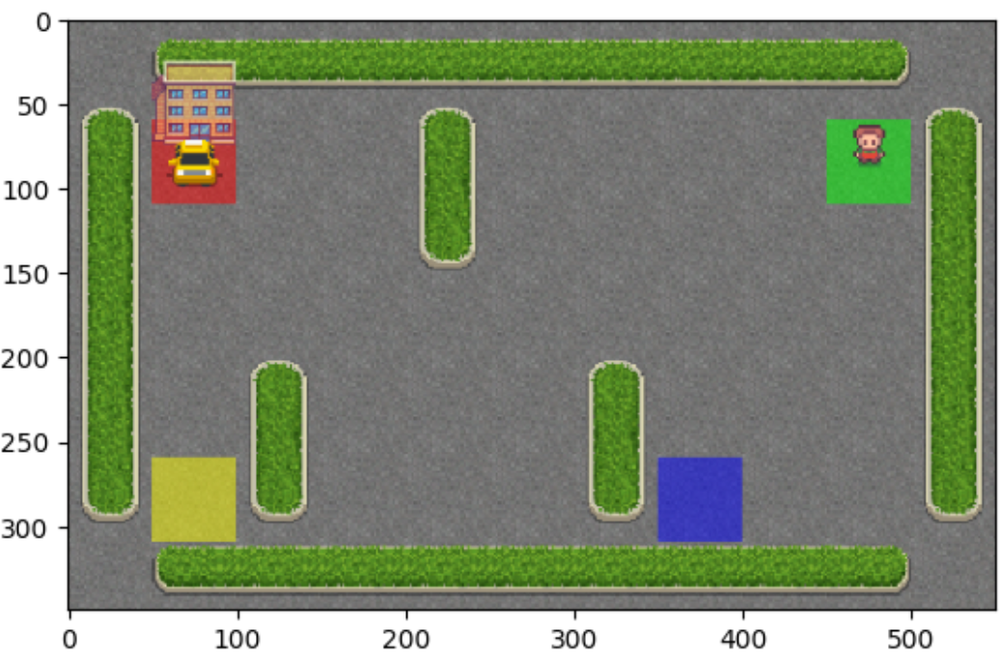
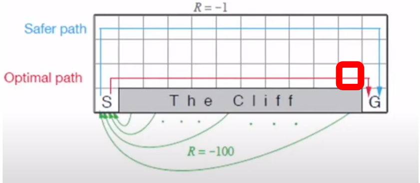

## Environment Introduction (toy taxi)

The action shape is (1,) in the range {0, 5} indicating which direction to move the taxi or to pickup/drop off passengers.

There are 500 discrete states since there are 25 taxi positions, 5 possible locations of the passenger (including the case when the passenger is in the taxi), and 4 destination locations.

## Comparison
Q-learning是基於下一狀態的最大獎勵來更新Q值
收斂速度較快：由於Q-learning是一種off-policy算法，它直接根據下一狀態的最大Q值來更新Q表，這使得它在很多情況下比SARSA收斂速度更快。
探索性更強：Q-learning總是選擇下一狀態的最大Q值動作，因此更具有探索性，能夠更快速地發現最優策略。

SARSA則是基於當前策略選擇的下一個動作的獎勵來更新Q值
穩定性更好：SARSA是一種on-policy算法，它根據當前策略來更新Q表，因此在隨機或不穩定的環境中，更新過程較為穩定。
策略一致性：SARSA所學得的策略與實際執行時的策略一致，這在一些應用場景中非常重要，比如在醫療或自動駕駛中。

#### Example

Q-Learning比較容易走到最佳解，但是也比較危險。因為越靠近Goal他的Q-value的值會越大。

比如說紅色那格如果是SARSA，然後走下cliff，那格state往下action的Q-value就很低，但是Q-Learning就算掉到cliff仍然會很高因為往右就會快走到Goal
